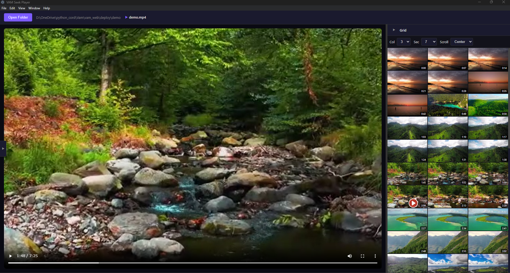

# VAM Seek Electron Demo

A desktop video player demo built with Electron, showcasing the [VAM Seek](https://github.com/YOUR_USERNAME/vam-seek) library for 2D thumbnail grid video seeking.



## Features

- Folder tree view for browsing local video files
- 2D thumbnail grid for visual video seeking (powered by VAM Seek)
- Resizable and collapsible panels
- Dark theme UI
- Supports MP4, WebM, MOV, AVI, MKV files

## Quick Start

```bash
# Clone the repository
git clone https://github.com/YOUR_USERNAME/vam-seek-electron-demo.git
cd vam-seek-electron-demo

# Install dependencies
npm install

# Run the app
npm start
```

## Project Structure

```
vam-seek-electron-demo/
├── src/
│   ├── main/
│   │   └── main.js          # Electron main process
│   ├── renderer/
│   │   ├── index.html       # Main HTML
│   │   ├── app.js           # Renderer application logic
│   │   ├── lib/
│   │   │   └── vam-seek.js  # VAM Seek library
│   │   └── styles/
│   │       └── main.css     # Styles
│   └── preload/
│       └── preload.js       # IPC bridge
├── package.json
└── README.md
```

## How It Works

This demo integrates VAM Seek into an Electron application:

1. **Main Process** (`main.js`): Handles file system operations and folder dialogs
2. **Preload Script** (`preload.js`): Exposes safe IPC APIs to the renderer
3. **Renderer** (`app.js`): Initializes VAM Seek and manages the UI

### VAM Seek Integration

```javascript
// Initialize VAM Seek when video metadata is loaded
video.addEventListener('loadedmetadata', () => {
  vamInstance = VAMSeek.init({
    video: video,
    container: gridContainer,
    columns: 4,
    secondsPerCell: 15,
    onSeek: (time) => console.log(`Seeked to ${time}s`)
  });
});
```

## Requirements

- Node.js 18+
- npm or yarn

## License

**Personal Use Only** - See [LICENSE](LICENSE) for details.

Commercial use and redistribution are prohibited without permission.

For commercial licensing inquiries, contact: haasiy@gmail.com

## Related

- [VAM Seek](https://github.com/unhaya/vam-seek) - The core library for 2D video seeking
